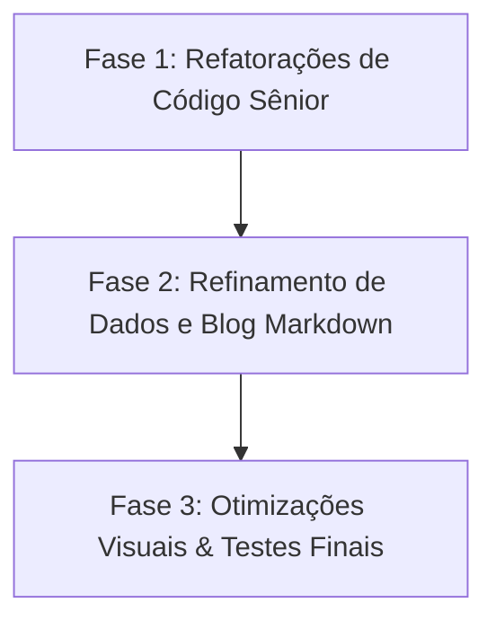

# Bruno Nyland — Portfolio 2026

## Roadmap de Finalização (Atualizado em 03/06/2026)

Este documento foi atualizado após a verificação das novas implementações realizadas (página de certificados com filtros e estatísticas, SEO dinâmico por rota, contraste a11y clareado e o menu móvel hambúrguer). O projeto compila com sucesso (`ng build`) e todos os 18 testes unitários com Vitest estão passando.

Abaixo, atuando como um desenvolvedor sênior em Angular, apresento uma análise das recentes adições, sugestões de refatoração para código limpo e o roadmap ajustado com os próximos passos.

---

## 1. Análise Sênior & Sugestões de Melhorias no Código Atual

As melhorias de arquitetura hoje foram excelentes (com roteamento, Lazy Loading e desacoplamento do Nav via `LayoutService`). Para elevar o nível do código aos padrões corporativos mais rigorosos do ecossistema Angular moderno, recomendo as seguintes refatorações:

### A. Modernização de Subscrições com `takeUntilDestroyed`

- **Onde:** No shell do aplicativo ([app.ts](file:///c:/Users/Usuario/Desktop/portifolio2/src/app/app.ts)).
- **Problema:** Você criou uma subscrição manual em `router.events` armazenando em `routerSub: Subscription`, que depois é limpa no `ngOnDestroy()`.
- **Refatoração Sênior:** Utilizar o operador `takeUntilDestroyed()` (introduzido na API de interop do RxJS com Signals no Angular 16+). Isso limpa o boilerplate de declarar a propriedade, implementar `OnDestroy` e fazer o unsubscribe manual. Ele limpa automaticamente a assinatura quando o contexto do componente é destruído.
  ```typescript
  import { takeUntilDestroyed } from '@angular/core/rxjs-interop';
  // No construtor:
  this.router.events
    .pipe(
      filter((e): e is NavigationEnd => e instanceof NavigationEnd),
      takeUntilDestroyed(),
    )
    .subscribe((e) => this.onRouteChange(e.urlAfterRedirects));
  ```

### B. Scroll Estável sem "Timeout Mágico"

- **Onde:** Método `onRouteChange` em [app.ts](file:///c:/Users/Usuario/Desktop/portifolio2/src/app/app.ts).
- **Problema:** O código utiliza `setTimeout(() => { ... }, 80)` para garantir que a renderização da rota se estabilize antes de recalcular o scroll do Lenis e ScrollTrigger. Prazos rígidos (como 80ms) podem quebrar em dispositivos lentos onde o carregamento de chunks demora mais.
- **Refatoração Sênior:** Substituir o `setTimeout` por callbacks do ciclo de renderização como o `afterNextRender` do Angular 17+ ou aguardar a estabilidade da zona com `NgZone.onStable`.

### C. Centralização e i18n dos Metadados SEO

- **Onde:** Construtores do [certificates.page.ts](file:///c:/Users/Usuario/Desktop/portifolio2/src/app/pages/certificates/certificates.page.ts) e [home.component.ts](file:///c:/Users/Usuario/Desktop/portifolio2/src/app/pages/home/home.component.ts).
- **Problema:** Os textos de metadados SEO (`titlePt`, `titleEn`, `descPt`, `descEn`) estão gravados diretamente (hardcoded) nos componentes.
- **Refatoração Sênior:** Mover esses metadados para o dicionário central de traduções em [content.data.ts](file:///c:/Users/Usuario/Desktop/portifolio2/src/app/content/content.data.ts) (ex: dentro de `dict().certs.seo` e `dict().home.seo`). Os componentes devem apenas consumir `this.seo.setMeta(this.content.dict().seo)`.

### D. Limpeza de Tickers e Listeners do GSAP

- **Onde:** Shell do app em [app.ts](file:///c:/Users/Usuario/Desktop/portifolio2/src/app/app.ts).
- **Problema:** O `gsap.ticker.add(...)` é registrado no init e não é removido no `ngOnDestroy()`. Em hot reload ou navegação com o shell recriado, isso pode gerar listeners duplicados.
- **Refatoração Sênior:** Armazenar a função do ticker e chamar `gsap.ticker.remove(handler)` no destroy. Idem para handlers do Lenis/ScrollTrigger quando aplicável.

### E. A11y: Respeitar `prefers-reduced-motion`

- **Onde:** Inicialização de animações no [app.ts](file:///c:/Users/Usuario/Desktop/portifolio2/src/app/app.ts) e componentes da home.
- **Problema:** Usuários com preferência por redução de movimento ainda recebem animações/scroll suave.
- **Refatoração Sênior:** Consultar `matchMedia('(prefers-reduced-motion: reduce)')` e desativar Lenis/GSAP quando necessário (ou reduzir duração e easing).

### F. SEO Completo (OG/Twitter/Canonical/Hreflang)

- **Onde:** [seo.service.ts](file:///c:/Users/Usuario/Desktop/portifolio2/src/app/core/seo.service.ts) e conteúdo central.
- **Problema:** Metadados básicos estão ok, mas faltam OpenGraph/Twitter cards, canonical e alternates por idioma.
- **Refatoração Sênior:** Expandir o `SeoService` para tags OG/Twitter, `link rel="canonical"` e `hreflang`, usando o dicionário por idioma.

### G. Performance de Imagens (LCP)

- **Onde:** Seções com imagens relevantes (Work/Certificates/Blog).
- **Problema:** Imagens sem otimização podem prejudicar LCP e Lighthouse.
- **Refatoração Sênior:** Adotar `NgOptimizedImage` e definir prioridades em imagens críticas, com tamanhos responsivos e lazy em não-críticas.

---

## 2. Roadmap de Finalização (Passo a Passo)



### Fase 1: Refatorações de Código Sênior (Recomendado) ✅ Concluída

- [x] **Modernizar Subscrições:** Substituir assinaturas manuais do Router por `takeUntilDestroyed` em [app.ts](file:///c:/Users/Usuario/Desktop/portifolio2/src/app/app.ts).
- [x] **Estabilizar Scroll de Rotas:** Trocar o `setTimeout` no controle de rota do App shell por um hook de ciclo de vida seguro (`afterNextRender`).
- [x] **Internacionalizar SEO:** Migrar as descrições do `SeoService` de [home.component.ts](file:///c:/Users/Usuario/Desktop/portifolio2/src/app/pages/home/home.component.ts) e [certificates.page.ts](file:///c:/Users/Usuario/Desktop/portifolio2/src/app/pages/certificates/certificates.page.ts) para o arquivo global [content.data.ts](file:///c:/Users/Usuario/Desktop/portifolio2/src/app/content/content.data.ts) (`dict().seo.{home,certs}`).
- [x] **Limpar Tickers/Listeners:** Remover handlers do `gsap.ticker` e outros listeners no `ngOnDestroy()` do shell.
- [ ] **A11y Motion:** Respeitar `prefers-reduced-motion`. _(Tentativa inicial com `MotionService` foi revertida a pedido: desligar o Lenis e usar scroll nativo piorava muito a sensação de scroll. Reavaliar futuramente uma abordagem que apenas **reduza duração/easing** do Lenis e das animações, sem desativar o scroll suave.)_
- [x] **SEO Completo:** Adicionar OG/Twitter, canonical e `hreflang` no `SeoService`.

### Fase 2: Refinamento de Dados e Blog com Markdown (.md)

- [ ] **Atualização de Projetos:** Alterar a tipagem do projeto em [content.types.ts](file:///c:/Users/Usuario/Desktop/portifolio2/src/app/content/content.types.ts) para incluir links e substituir os textos descritivos temporários por dados reais no [content.data.ts](file:///c:/Users/Usuario/Desktop/portifolio2/src/app/content/content.data.ts).
- [ ] **Infraestrutura e Índice do Blog:** Criar a pasta `/public/blog/`, adicionar os arquivos `.md` e criar o arquivo de índice `/public/blog/posts.json` contendo o array de metadados dos posts (slug, título, data, tag, resumo e marcador `featured` de destaque).
- [ ] **Seleção de Destaques na Home:** Atualizar a seção do blog na home (`BlogComponent`) para baixar o arquivo `posts.json` via `BlogService` e mostrar apenas posts marcados com `featured: true` (evitando requisições excessivas de arquivos `.md`).
- [ ] **Página Geral do Blog (`/blog`):** Desenvolver uma página de índice geral do blog contendo:
  - Filtro por tags e busca por palavra-chave utilizando reatividade com _Angular Signals_ (`computed`).
  - Infinite Loader (Scroll Infinito) automatizado utilizando a API do navegador `IntersectionObserver` para carregar novos itens dinamicamente à medida que o usuário rola o rodapé da página.
- [ ] **Serviço e Tela de Detalhes do Post:** Implementar o método `getPost(slug)` no `BlogService` para baixar o arquivo `.md` sob demanda e renderizá-lo na rota dinâmica `/blog/:slug` de forma segura (usando `DomSanitizer`), adicionando realce de sintaxe de código (syntax highlighting) para desenvolvedores.
- [ ] **Estados de UI:** Adicionar estados de loading/erro/vazio para certificados e blog (evitar tela sem feedback).

### Fase 3: Otimizações Visuais e Testes Finais

- [ ] **Otimização Three.js:** Testar a performance da malha 3D em dispositivos móveis e ajustar a densidade de partículas de forma dinâmica se o FPS cair de 60.
- [ ] **Otimização de Imagens (LCP):** Adotar `NgOptimizedImage` e priorizar imagens críticas para melhorar métricas.
- [ ] **Cobertura de Testes com Vitest:** Adicionar testes de unidade para o `CertificatesService`, `SeoService` e componentes de rotas.
- [ ] **Auditoria AOT:** Executar `npm run build` final em produção para garantir 100% de integridade antes da entrega.
