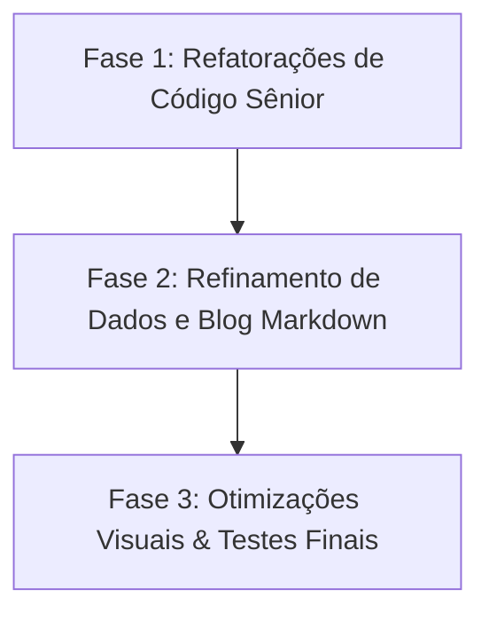

# Bruno Nyland — Portfolio 2026

## Roadmap de Finalização (Atualizado em 03/06/2026)

Este documento foi atualizado após a verificação das novas implementações realizadas (página de certificados com filtros e estatísticas, SEO dinâmico por rota, contraste a11y clareado e o menu móvel hambúrguer). O projeto compila com sucesso (`ng build`) e todos os 18 testes unitários com Vitest estão passando.

Abaixo, atuando como um desenvolvedor sênior em Angular, apresento uma análise das recentes adições, sugestões de refatoração para código limpo e o roadmap ajustado com os próximos passos.

---

## 1. Análise Sênior & Sugestões de Melhorias no Código Atual

As melhorias de arquitetura hoje foram excelentes (com roteamento, Lazy Loading e desacoplamento do Nav via `LayoutService`). Para elevar o nível do código aos padrões corporativos mais rigorosos do ecossistema Angular moderno, recomendo as seguintes refatorações:

### A. Modernização de Subscrições com `takeUntilDestroyed`

- **Onde:** No shell do aplicativo ([app.ts](file:///c:/Users/Usuario/Desktop/portifolio2/src/app/app.ts)).
- **Problema:** Você criou uma subscrição manual em `router.events` armazenando em `routerSub: Subscription`, que depois é limpa no `ngOnDestroy()`.
- **Refatoração Sênior:** Utilizar o operador `takeUntilDestroyed()` (introduzido na API de interop do RxJS com Signals no Angular 16+). Isso limpa o boilerplate de declarar a propriedade, implementar `OnDestroy` e fazer o unsubscribe manual. Ele limpa automaticamente a assinatura quando o contexto do componente é destruído.
  ```typescript
  import { takeUntilDestroyed } from '@angular/core/rxjs-interop';
  // No construtor:
  this.router.events
    .pipe(
      filter((e): e is NavigationEnd => e instanceof NavigationEnd),
      takeUntilDestroyed(),
    )
    .subscribe((e) => this.onRouteChange(e.urlAfterRedirects));
  ```

### B. Scroll Estável sem "Timeout Mágico"

- **Onde:** Método `onRouteChange` em [app.ts](file:///c:/Users/Usuario/Desktop/portifolio2/src/app/app.ts).
- **Problema:** O código utiliza `setTimeout(() => { ... }, 80)` para garantir que a renderização da rota se estabilize antes de recalcular o scroll do Lenis e ScrollTrigger. Prazos rígidos (como 80ms) podem quebrar em dispositivos lentos onde o carregamento de chunks demora mais.
- **Refatoração Sênior:** Substituir o `setTimeout` por callbacks do ciclo de renderização como o `afterNextRender` do Angular 17+ ou aguardar a estabilidade da zona com `NgZone.onStable`.

### C. Centralização e i18n dos Metadados SEO

- **Onde:** Construtores do [certificates.page.ts](file:///c:/Users/Usuario/Desktop/portifolio2/src/app/pages/certificates/certificates.page.ts) e [home.component.ts](file:///c:/Users/Usuario/Desktop/portifolio2/src/app/pages/home/home.component.ts).
- **Problema:** Os textos de metadados SEO (`titlePt`, `titleEn`, `descPt`, `descEn`) estão gravados diretamente (hardcoded) nos componentes.
- **Refatoração Sênior:** Mover esses metadados para o dicionário central de traduções em [content.data.ts](file:///c:/Users/Usuario/Desktop/portifolio2/src/app/content/content.data.ts) (ex: dentro de `dict().certs.seo` e `dict().home.seo`). Os componentes devem apenas consumir `this.seo.setMeta(this.content.dict().seo)`.

### D. Limpeza de Tickers e Listeners do GSAP

- **Onde:** Shell do app em [app.ts](file:///c:/Users/Usuario/Desktop/portifolio2/src/app/app.ts).
- **Problema:** O `gsap.ticker.add(...)` é registrado no init e não é removido no `ngOnDestroy()`. Em hot reload ou navegação com o shell recriado, isso pode gerar listeners duplicados.
- **Refatoração Sênior:** Armazenar a função do ticker e chamar `gsap.ticker.remove(handler)` no destroy. Idem para handlers do Lenis/ScrollTrigger quando aplicável.

### E. SEO Completo (OG/Twitter/Canonical/Hreflang)

- **Onde:** [seo.service.ts](file:///c:/Users/Usuario/Desktop/portifolio2/src/app/core/seo.service.ts) e conteúdo central.
- **Problema:** Metadados básicos estão ok, mas faltam OpenGraph/Twitter cards, canonical e alternates por idioma.
- **Refatoração Sênior:** Expandir o `SeoService` para tags OG/Twitter, `link rel="canonical"` e `hreflang`, usando o dicionário por idioma.

### F. Performance de Imagens (LCP)

- **Onde:** Seções com imagens relevantes (Work/Certificates/Blog).
- **Problema:** Imagens sem otimização podem prejudicar LCP e Lighthouse.
- **Refatoração Sênior:** Adotar `NgOptimizedImage` e definir prioridades em imagens críticas, com tamanhos responsivos e lazy em não-críticas.

---

## 2. Roadmap de Finalização (Passo a Passo)



### Fase 1: Refatorações de Código Sênior (Recomendado) ✅ Concluída

- [x] **Modernizar Subscrições:** Substituir assinaturas manuais do Router por `takeUntilDestroyed` em [app.ts](file:///c:/Users/Usuario/Desktop/portifolio2/src/app/app.ts).
- [x] **Estabilizar Scroll de Rotas:** Trocar o `setTimeout` no controle de rota do App shell por um hook de ciclo de vida seguro (`afterNextRender`).
- [x] **Internacionalizar SEO:** Migrar as descrições do `SeoService` de [home.component.ts](file:///c:/Users/Usuario/Desktop/portifolio2/src/app/pages/home/home.component.ts) e [certificates.page.ts](file:///c:/Users/Usuario/Desktop/portifolio2/src/app/pages/certificates/certificates.page.ts) para o arquivo global [content.data.ts](file:///c:/Users/Usuario/Desktop/portifolio2/src/app/content/content.data.ts) (`dict().seo.{home,certs}`).
- [x] **Limpar Tickers/Listeners:** Remover handlers do `gsap.ticker` e outros listeners no `ngOnDestroy()` do shell.
- [x] **SEO Completo:** Adicionar OG/Twitter, canonical e `hreflang` no `SeoService`.

### Fase 2: Refinamento de Dados e Blog com Markdown (.md)

- [ ] **Atualização de Projetos:** Alterar a tipagem do projeto em [content.types.ts](file:///c:/Users/Usuario/Desktop/portifolio2/src/app/content/content.types.ts) para incluir links e substituir os textos descritivos temporários por dados reais no [content.data.ts](file:///c:/Users/Usuario/Desktop/portifolio2/src/app/content/content.data.ts). _(Pendente: aguardando os dados reais dos projetos.)_
- [x] **Infraestrutura e Índice do Blog:** `/public/blog/` com os `.md` bilíngues (`{slug}.{pt,en}.md`) e o índice `/public/blog/posts.json` (slug, data, tag, título, resumo, `featured`). _Conteúdo dos posts pendente do autor — corpos com placeholder._
- [x] **Seleção de Destaques na Home:** [`BlogComponent`](file:///c:/Users/Usuario/Desktop/portifolio2/src/app/sections/blog.component.ts) consome `posts.json` via [`BlogService`](file:///c:/Users/Usuario/Desktop/portifolio2/src/app/pages/blog/blog.service.ts) e mostra só os `featured`, com CTA para `/blog`.
- [x] **Página Geral do Blog (`/blog`):** [blog.page.ts](file:///c:/Users/Usuario/Desktop/portifolio2/src/app/pages/blog/blog.page.ts) com:
  - Filtro por tags e busca por palavra-chave com _Angular Signals_ (`computed`).
  - Scroll infinito via `IntersectionObserver` (carrega +6 posts ao se aproximar do rodapé).
- [x] **Serviço e Tela de Detalhes do Post:** `BlogService.getPost(slug, lang)` baixa o `.md` sob demanda e renderiza em `/blog/:slug` de forma segura (`DomSanitizer`), com realce de sintaxe (marked + highlight.js, carregados sob demanda).
- [x] **Estados de UI:** Loading/erro/vazio para certificados e blog (índice e detalhe).

### Fase 3: Otimizações Visuais e Testes Finais

- [x] **Otimização Three.js:** Qualidade adaptativa em [scene.service.ts](file:///c:/Users/Usuario/Desktop/portifolio2/src/app/scene/scene.service.ts) — monitor de FPS no loop de render baixa o nível (pixel ratio + densidade de partículas via `setDrawRange`) se a média cair; dispositivos de toque/telas pequenas começam em nível reduzido e sem antialias.
- [ ] **Otimização de Imagens (LCP):** Adotar `NgOptimizedImage`. _(N/A no momento: o app não tem imagens raster — Work usa placeholders de texto, certificados são PDFs e o blog ainda não tem imagens. Aplicar quando os projetos receberem capas/imagens reais, junto com o item de Projetos da Fase 2.)_
- [x] **Cobertura de Testes com Vitest:** Specs adicionados para `CertificatesService`, `SeoService`, `BlogService` e `renderMarkdown` (32 testes no total, todos verdes). _(Componentes de rota não foram montados em teste por dependerem de GSAP/Three/IntersectionObserver — coberto via testes de serviço + render.)_
- [x] **Auditoria AOT:** `npm run build` de produção passa sem erros nem estouro de budget (inicial ~478 kB; `three` e `markdown` em chunks lazy).
